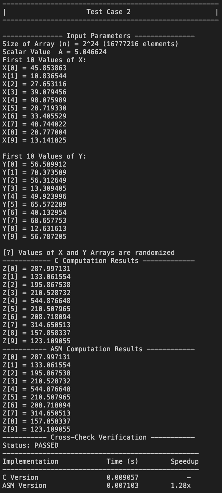
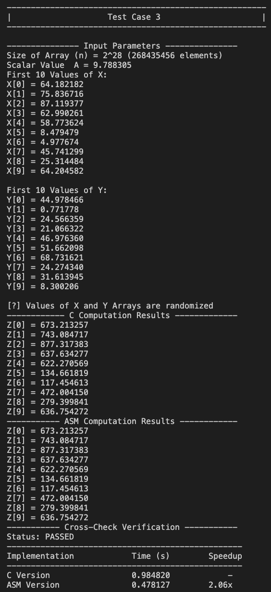

# x86-to-C-interface-LBYARCH README

## Project Specifications

Write the kernel in (1) C program and (2) an x86-64 assembly language.  The kernel is to perform SAXPY (A*X + Y) function.

*Required to use functional scalar SIMD registers

*Required to use functional scalar SIMD floating-point instructions

Input: Scalar variable n (integer) contains the length of the vector;  Scalar variable A is a single-precision float. Vectors X, Y and Z are single-precision float.

Process:  Z[i] = A × X[i] + Y[i]

Example:

A --> 2.0

x -> 1.0, 2.0, 3.0

y -> 11.0, 12.0, 13.0

(answer) z--> 13.0, 16.0, 19.0

Output: store result in vector Z.  Display the result of 1st ten elements of vector Z for all versions of kernel (i.e., C and x86-64).

Note:

1.) Write a C main program to call the kernels of the C version and x86-64 assembly language.

2.) Time the kernel portion only.  

3.) For each kernel version, time the process for vector size n = {220, 224, and  230}.  If 230 is impossible, you may reduce it to the point your machine can support (i.e.,  228 or 229).

4.) You must run at least 30 times for each version to get the average execution time. 

5.) For the data, you may initialize each vector and scalar variable with the same or different random value. 

6.) You will need to check the correctness of your output.  Thus, if the C version is your "sanity check answer key," then the output of the x86-64 version has to be checked with the C version and output correspondingly (i.e., the x86-64 kernel output is correct, etc.).

7.) Output in GitHub (make sure that I can access your Github):

a.) Github readme containing the following (C and x86-64):

        i.) comparative execution time and short analysis of the performance of the kernels

       ii.) Take a screenshot of the program output with the correctness check (C).

       iii.) Take a screenshot of the program output, including the correctness check (x86-64).

       iv.) short videos (5-10mins) showing your source code, compilation, and execution of the C and x86-64 program

b.) Visual Studio project folder containing complete files (source code: C, x86-64, and all other required files) for others to load and execute your program.

## Requirements Checklist

### 1.) Write a C main program to call the kernels of the C version and x86-64 assembly language.

**Implementation in the:** `main.c`
```c
saxpy_c(n, A, X, Y, Z_c);
saxpy_asm(n, A, X, Y, Z_asm);
```

### 2.) Time the kernel portion only.

**Implementation in the:** `main.c`
```c
double start = get_time();
for (int r = 0; r < RUNS; r++)
{
    saxpy_c(n, A, X, Y, Z_c);
}
double time_c = (get_time() - start) / RUNS;

start = get_time();
for (int r = 0; r < RUNS; r++)
{
    saxpy_asm(n, A, X, Y, Z_asm);
}
double time_asm = (get_time() - start) / RUNS;
```

### 3.) For each kernel version, time the process for vector size n = {2^20, 2^24, and 2^30}.

**Implementation in the:** `main.c`
```c
int sizes[] = {1 << 20, 1 << 24, 1 << 28}; // 2^20, 2^24, 2^28
```
Note: We used 2^28 instead of 2^30 since our machines cant process 2^30 efficiently.

### 4.) You must run at least 30 times for each version to get the average execution time.

**Implementation in the:** `main.c`
```c
const int RUNS = 30;
```

### 5.) For the data, you may initialize each vector and scalar variable with the same or different random value.

**Implementation in the:** `main.c`
```c
float A = ((float)rand() + 1.0f) / ((float)RAND_MAX + 1.0f) * 10.0f;

for (int i = 0; i < n; i++)
{
    X[i] = (float)rand() / RAND_MAX * 100.0f;
    Y[i] = (float)rand() / RAND_MAX * 100.0f;
}
```

### 6.) You will need to check the correctness of your output.

**Implementation in the:** `main.c`
```c
int verify(float Z_c[], float Z_asm[], int n)
{
    for (int i = 0; i < n; i++)
    {
        if (fabsf(Z_c[i] - Z_asm[i]) > 1e-5f)
        {
            printf("ERROR at index %d: C=%.6f, ASM=%.6f\n", i, Z_c[i], Z_asm[i]);
            return 0;
        }
    }
    return 1;
}
```

### Required to use functional scalar SIMD registers

**C Implementation:** `math.c`
```c
__m128 a = _mm_load_ss(&A);
__m128 x = _mm_load_ss(&X[i]);
__m128 y = _mm_load_ss(&Y[i]);
```

**Assembly Implementation:** `math.asm`
```asm
movss xmm1, [rsi + rax*4]
movss xmm2, [rdx + rax*4]
```

### Required to use functional scalar SIMD floating-point instructions

**C Implementation:** `math.c`
```c
__m128 result = _mm_mul_ss(a, x);
result = _mm_add_ss(result, y);
_mm_store_ss(&Z[i], result);
```

**Assembly Implementation:** `math.asm`
```asm
mulss xmm1, xmm0
addss xmm1, xmm2
movss [rcx + rax*4], xmm1
```

## Project Deliverables

### i.) Comparative execution time and short analysis of the performance of the kernels

**Performance results based on our ii. program screenshots:**

| Test Case | Array Size (Elements) | C Time (s) | ASM Time (s) | Speedup |
|-----------|-----------------------|------------|--------------|---------|
| **1**     | 2^20 (1,048,576)      | 0.000565   | 0.000451     | **1.25x** |
| **2**     | 2^24 (16,777,216)     | 0.009057   | 0.007103     | **1.28x** |
| **3**     | 2^28 (268,435,456)    | 0.984820   | 0.478127     | **2.06x** |

**Analysis:**
Based on the average execution times across all three test cases, the ASM implementation consistently runs faster than the C kernel. This difference in performance can be explained by two main factors. First, assembly language allows the programmer to write instructions at a low level (since assembly is a low-level language), which then reduces the unnecessary operations,  giving full control over how data is moved, stored, and processed by the way it is coded by the user. From this, it removes all overhead that happens in C when the code is compiled by the compiler. 

The second reason could be the use of SIMD registers by both C and assembly. In c, since the SIMD implementation is from an external library, the compiler still decides how to process the instructions given in the source code so this could mean that even if we used SIMD registers, it isnt as optimized as assembly, given that we have full control of SIMD registers in the latter. 

### ii.) C and Assembly Program output with correctness check






### iii.) Short videos (5-10mins) showing your source code, compilation, and execution of the C and x86-64 program

[Project Demo](https://drive.google.com/file/d/1hkaGMKAEioJ6zI4LIclFHX2ieDHHH8uA/view?usp=sharing)

